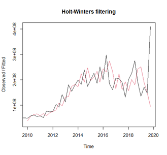
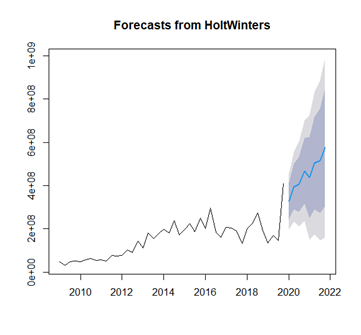
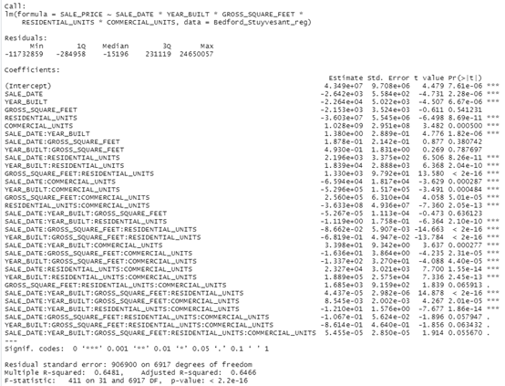

### Introduction ###
This report aims to apply R-Studio to import the NYC Real Estate data from the Boston
University SQL server, and do time series analysis on the total dollar amount by
quarters as well as use two multiple regression models to forecast for the sale and
determine the sale of properties.

### Author ###
Ivan Chen